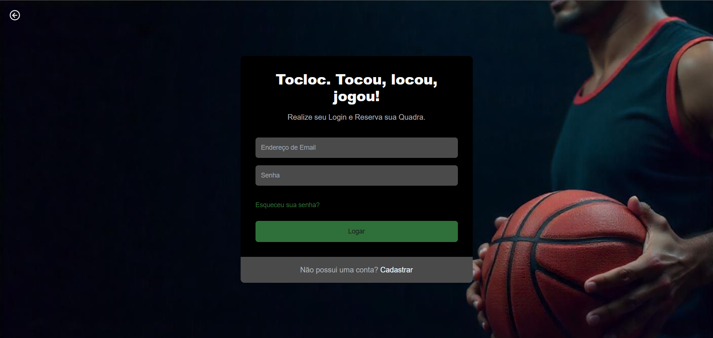

# TocLoc  ⚽️ ⚡ 


<div align="center">

  
  
</div>

---

## 📝 Sobre  

A **TocLoc** é uma plataforma para facilitar a reserva de locais esportivos, como quadras de beach tennis e campos de futebol society.  
O objetivo principal é conectar jogadores e donos de espaços, promovendo agilidade e eficiência na reserva e organização de jogos.  

---

## 🛠 Tecnologias  

### Front-End  
- **React.js**: Framework para criação de interfaces dinâmicas.  
- **Tailwind CSS**: Framework CSS para estilização rápida e responsiva.  
- **CSS e HTML**: Estrutura básica e personalização.  
- **React Router**: Gerenciamento de rotas no front-end.  
- **Axios**: Biblioteca para requisições HTTP.  

### Back-End  
- **Node.js**: Ambiente de execução para JavaScript no servidor.  
- **Express.js**: Framework para construção da API.  
- **JWT (JSON Web Token)**: Autenticação segura.  

### Banco de Dados  
- **Supabase**: Solução para gerenciamento de banco de dados com suporte a autenticação e armazenamento.  

---

## ✨ Funcionalidades  

- **CRUD Completo**: Gerenciamento de reservas, usuários e locais esportivos.  
- **Arquitetura Multicamadas**: Separação de responsabilidades entre camadas de apresentação, lógica de negócios e dados.  

---

## 🚀 Como executar o projeto  

### Pré-requisitos  
- Node.js instalado  
- Gerenciador de pacotes (npm ou yarn)  

### Instalação  

1. Clone o repositório:  
   ```bash
   git clone https://github.com/laissilva04/tocloc-frontend/
2. Acesse o diretório do projeto::  
   ```bash
   cd TocLoc
3. Instale as dependências do back-end e do front-end::  
   ```bash
   npm install
4. Inicie o servidor:  
   ```bash
   npm start
   
## 👥 Contribuidores
@Laissilva04
@Liviacavalcanter

 Link para o repositório do back-end 👉: https://github.com/laissilva04/tocloc-backend
